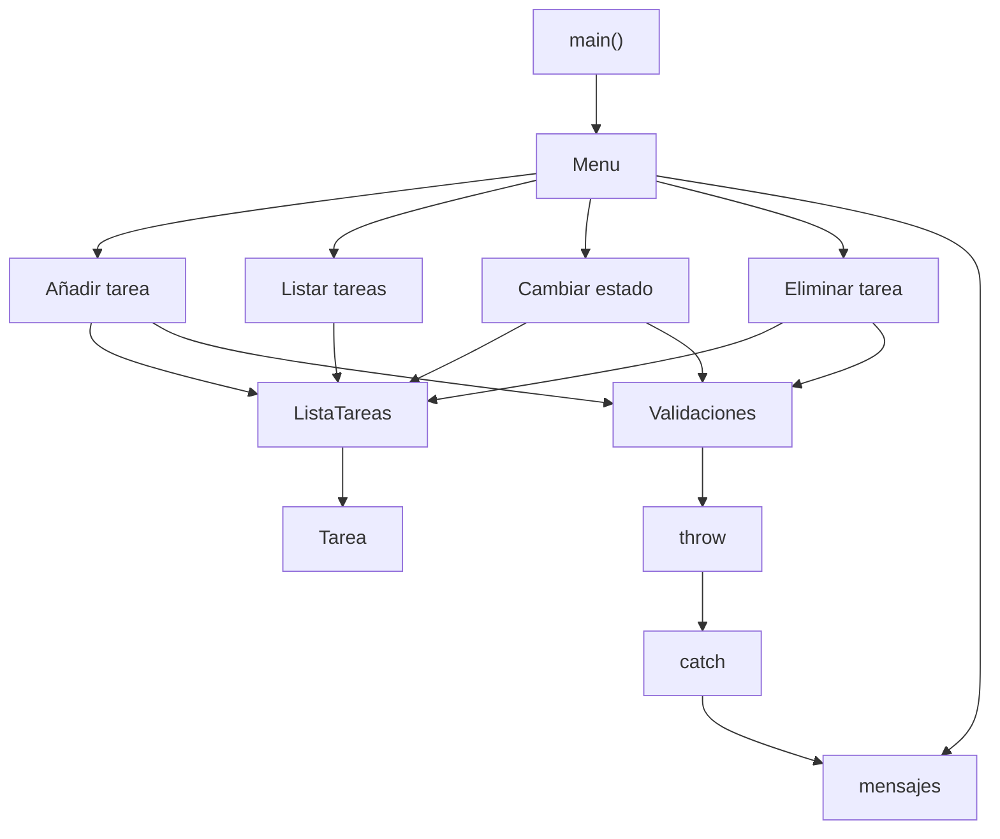
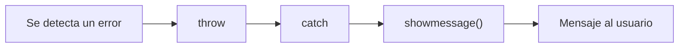
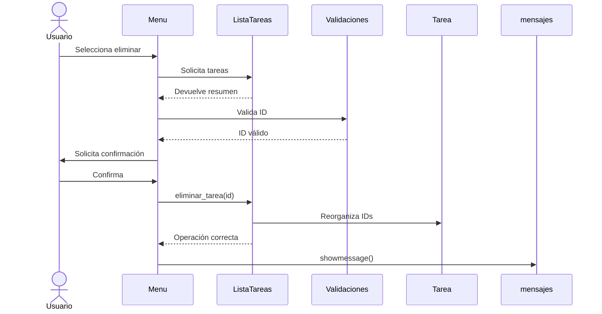

<!-- ===================== HEADER ===================== -->

<p align="center">
  
</p>

<p align="center">
  
</p>

<p align="center">


</p>

---

# ✦ Sobre el proyecto

**To-Do List** es una aplicación de consola desarrollada en **C++** para administrar tareas mediante operaciones de creación, consulta, modificación y eliminación.

El proyecto fue desarrollado para la asignatura de **Programación Orientada a Objetos**, aplicando conceptos como:

- Clases y objetos
- Encapsulamiento
- Modularización
- Validaciones
- Manejo de excepciones
- Separación de responsabilidades
- Trabajo colaborativo
- Control de versiones con Git y GitHub

---

# ✦ Funcionalidades

<table>
<tr>
<td width="50%">

### ➕ Gestión de tareas

- Crear nuevas tareas
- Asignar ID automáticamente
- Guardar título
- Guardar descripción
- Registrar estado
- Registrar fecha

</td>

<td width="50%">

### ⚙️ Administración

- Listar tareas
- Cambiar estados
- Eliminar tareas
- Renumerar IDs
- Validar entradas
- Confirmar eliminaciones

</td>
</tr>
</table>

Los estados disponibles son:

```text
Pendiente
En progreso
Completada
```

---

# ✦ Vista del menú

```text
╔════════════════════════════════╗
║          TO-DO LIST            ║
╠════════════════════════════════╣
║  1. Añadir tarea               ║
║  2. Listar tareas              ║
║  3. Cambiar estado             ║
║  4. Eliminar tarea             ║
║  5. Salir                      ║
╚════════════════════════════════╝
```

---

# ✦ Arquitectura



---

# ✦ Estructura del proyecto

```text
TO-DO LIST
│
├── To-do list.cpp
│   └── Punto de entrada principal
│
├── Tarea.h
├── Tarea.cpp
│   └── Representa una tarea individual
│
├── ListaTareas.h
├── ListaTareas.cpp
│   └── Administra todas las tareas
│
├── menu.h
├── Menu.cpp
│   └── Controla la interacción con el usuario
│
├── Validaciones.h
├── Validaciones.cpp
│   └── Controla y valida las entradas
│
├── mensajes.h
└── mensajes.cpp
    └── Centraliza la salida de mensajes
```

---

# ✦ Clases principales

## `Tarea`

Representa una tarea individual dentro del sistema.

Cada objeto contiene:

```text
┌─────────────────┐
│      TAREA      │
├─────────────────┤
│ ID              │
│ Título          │
│ Descripción     │
│ Estado          │
│ Fecha           │
└─────────────────┘
```

La clase también contiene métodos para consultar y modificar sus atributos.

---

## `ListaTareas`

Administra el conjunto completo de tareas.

Internamente utiliza:

```cpp
vector<Tarea> tareas;
```

Sus principales responsabilidades son:

```text
ListaTareas
│
├── agregar_tarea()
├── eliminar_tarea()
├── existe_tarea()
├── cantidad()
├── listarTareas()
├── mostrar_resumen()
└── cambiar_estado()
```

En resumen:

```text
Tarea
└── representa UNA tarea

ListaTareas
└── administra TODAS las tareas
```

---

## `Menu`

La clase `Menu` controla la interacción principal con el usuario.

Se encarga de:

- Mostrar las opciones
- Recibir selecciones
- Conectar las acciones
- Mostrar información mediante `showmessage()`

---

## `mensajes`

Para evitar utilizar `cout` directamente en diferentes archivos, se creó una clase encargada de centralizar los mensajes.

### Antes

```cpp
cout << "Tarea eliminada correctamente.";
```

### Ahora

```cpp
mensajes::showmessage(
    "Tarea eliminada correctamente.\n"
);
```

Esto permite que la salida del programa se encuentre centralizada.

---

# ✦ Manejo de excepciones

Los errores se manejan utilizando:

```cpp
throw
```

Por ejemplo:

```cpp
if (!lista.existe_tarea(id))
{
    throw invalid_argument(
        "Error: no existe ninguna tarea con ese ID."
    );
}
```

La excepción posteriormente se captura:

```cpp
catch (const exception& e)
{
    mensajes::showmessage(
        e.what()
    );
}
```

### Flujo



---

# ✦ Validaciones

El sistema evita entradas incorrectas mediante funciones reutilizables.

| Validación | Descripción |
|---|---|
| 🔢 Número válido | Evita letras cuando se espera un número |
| 📏 Rango | Comprueba límites permitidos |
| 📝 Texto vacío | Impide campos obligatorios vacíos |
| 📐 Longitud | Controla el tamaño máximo del texto |
| 🔎 ID existente | Verifica que la tarea exista |
| ✅ Confirmación | Solicita respuesta `s/n` |

---

# ✦ Ejemplo de ejecución

```text
========== TO-DO LIST ==========
1. Añadir tarea
2. Listar tareas
3. Cambiar estado
4. Eliminar tarea
5. Salir
================================

Selecciona una opcion: 1

========== AÑADIR TAREA ==========

Ingresa el titulo de la tarea:
Proyecto POO

Ingresa la descripcion de la tarea:
Terminar To-Do List

Tarea añadida correctamente.
ID asignado: 1
```

---

# ✦ Listado de tareas

El programa organiza las tareas en formato de tabla:

```text
ID   Descripcion                        Estado              Fecha
---------------------------------------------------------------------------
1    Hacer tarea                        pendiente           17/09/2026
2    Estudiar C++                       en progreso         17/09/2026
3    Terminar proyecto                  completada          16/09/2026
```

---

# ✦ Flujo de una operación

### Ejemplo: eliminar una tarea



---

# ✦ Mejoras realizadas

<details>

<summary><b>🔧 Ver correcciones realizadas durante el desarrollo</b></summary>

<br>

### Integración de clases

Se unificaron las diferentes versiones de `Tarea` y `ListaTareas` utilizadas durante el desarrollo.

### IDs automáticos

Cada nueva tarea recibe automáticamente un identificador.

```text
1 → 2 → 3 → 4 → ...
```

### Renumeración

Después de eliminar una tarea:

```text
ANTES

1
2
3
4

Eliminar ID 2

DESPUÉS

1
2
3
```

### Validación de IDs

El programa comprueba que una tarea exista antes de modificarla o eliminarla.

### Confirmación antes de eliminar

```text
Seguro que quieres eliminarla? (s/n):
```

### Centralización de mensajes

Los mensajes anteriormente enviados mediante `cout` fueron centralizados utilizando:

```cpp
mensajes::showmessage();
```

### Manejo de excepciones

Los errores utilizan:

```text
throw
  ↓
catch
  ↓
showmessage
```

</details>

---

# ✦ Tecnologías

<p align="center">


</p>

<table align="center">
<tr>
<td align="center"><b>C++</b></td>
<td align="center"><b>Visual Studio</b></td>
<td align="center"><b>Git</b></td>
<td align="center"><b>GitHub</b></td>
</tr>
</table>

---

# ✦ Equipo

<table>
<tr>
<th>Integrante</th>
<th>Participación</th>
</tr>

<tr>
<td><b>Camila Andrea Jaimez Martinez</b></td>
<td>Estructura de <code>Tarea</code> y funcionalidad para añadir tareas</td>
</tr>

<tr>
<td><b>Ary Gabriela de la Cruz Peralta</b></td>
<td>Administración de <code>ListaTareas</code>, eliminación y validaciones</td>
</tr>

<tr>
<td><b>Sofia Watts Feria</b></td>
<td>Funcionalidad para cambiar el estado de las tareas</td>
</tr>

<tr>
<td><b>Paulina Cancino Vichi</b></td>
<td>Menú, listado de tareas e integración del programa</td>
</tr>

</table>

---

# ✦ Instalación

### 1. Clonar el repositorio

```bash
git clone https://github.com/Chavalinas/To-Do-List.git
```

### 2. Entrar al proyecto

```bash
cd To-Do-List
```

### 3. Abrir en Visual Studio

Abre la solución del proyecto utilizando:

```text
Visual Studio
```

### 4. Compilar

```text
Compilar
   ↓
Compilar solución
```

### 5. Ejecutar

```text
Depurador local de Windows
```

---

# ✦ Objetivos de aprendizaje

Durante el desarrollo del proyecto se trabajaron conceptos como:

```text
Programación Orientada a Objetos
          │
          ├── Clases
          ├── Objetos
          ├── Encapsulamiento
          ├── Métodos
          ├── Modularización
          ├── Validaciones
          ├── Excepciones
          └── Trabajo colaborativo
```

---

# 🎓 Información académica

<p align="center">

### Universidad Autónoma de Guadalajara  
#### Campus Tabasco

**Ingeniería en Software y Minería de Datos**

**Programación Orientada a Objetos**

**Docente:** Manuel Balderas

</p>

---

<p align="center">

### ✦ TO-DO LIST ✦

Desarrollado colaborativamente en **C++**.

<br>


</p>

<p align="center">
  
</p>
